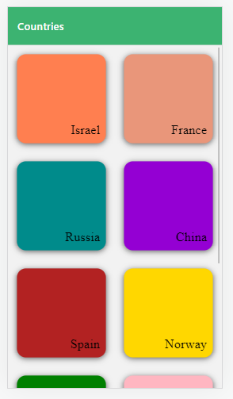

# Stylise the conutries:



#### Send color in props in `CountriesScreen.js`

```js
import React from "react";
import { StyleSheet, FlatList } from "react-native";

import { COUNTRIES } from "../data/dummy-data";
import CountryGridTile from "../components/CountryGridTile";

const CountriesScreen = ({ navigation }) => {
  const renderGridItem = ({ item }) => {
    return (
      <CountryGridTile
        title={item.title}
        // send the color of each country:
        color={item.color}
        onSelect={() => {
          navigation.navigate("CountryTrip", {
            countryId: item.id,
          });
        }}
      />
    );
  };

  return (
    <FlatList
      keyExtractor={(item, index) => item.id}
      data={COUNTRIES}
      renderItem={renderGridItem}
      numColumns={2}
    />
  );
};

CountriesScreen.navigationOptions = {
  headerTitle: "Trip countries",
};

const styles = StyleSheet.create({
  container: {
    flex: 1,
    padding: 10,
    justifyContent: "center",
    alignItems: "center",
  },
});

export default CountriesScreen;
```

### in CountryGridTile

- Use color
- Add Design in styles.

```js
import React from "react";
import { View, Text, StyleSheet, TouchableOpacity } from "react-native";

// in Text -> change to props.title
const CountryGridTile = (props) => {
  return (
    <TouchableOpacity style={styles.gridItem} onPress={props.onSelect}>
      <View style={[styles.container, { backgroundColor: props.color }]}>
        <Text style={styles.title}>{props.title}</Text>
      </View>
    </TouchableOpacity>
  );
};

const styles = StyleSheet.create({
  screen: {
    flex: 1,
    justifyContent: "center",
    alignItems: "center",
  },
  gridItem: {
    flex: 1,
    margin: 15,
    height: 150,
  },
  // 2. Add style to container:
  container: {
    flex: 1,
    borderRadius: 15,
    shadowColor: "black",
    shadowOpacity: 0.6,
    shadowOffset: { width: 0, height: 2 },
    shadowRadius: 10,
    elevation: 3, // for android - to see the shadow
    justifyContent: "flex-end",
    alignItems: "flex-end",
  },
  // 3. Add style to title:
  title: {
    fontFamily: "pattaya-regular",
    fontSize: 22,
    margin: 10,
  },
});

export default CountryGridTile;
```
